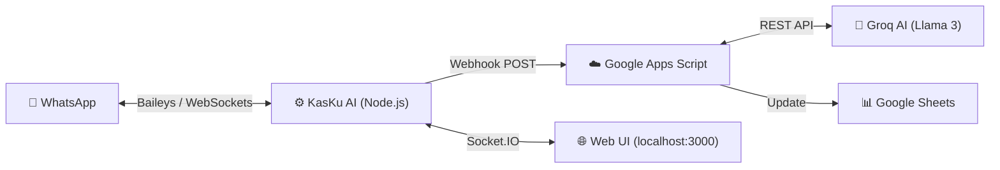

# 🤖 KasKu AI - Pusat Kendali Bot WhatsApp Keuangan

**KasKu AI** adalah sebuah aplikasi lokal berbasis Node.js yang berfungsi sebagai pusat kendali (*Control Center*) untuk bot pencatat keuangan WhatsApp. Aplikasi ini menghubungkan WhatsApp Anda dengan **Google Apps Script** dan kecerdasan buatan **Groq (Llama 3)** untuk mencatat transaksi sehari-hari langsung ke dalam Google Sheets secara otomatis.

 *(Catatan: Tambahkan screenshot dashboard Anda di sini)*

## ✨ Fitur Utama

- **Real-time WhatsApp Connection**: Terintegrasi langsung dengan WhatsApp Web via library [Baileys](https://github.com/WhiskeySockets/Baileys).
- **Web Dashboard Premium**: Antarmuka pengguna (UI) modern dengan *Dark Theme* dan efek *Glassmorphism* untuk memantau status bot dan log aktivitas.
- **Smart AI Extractor**: Memahami bahasa natural. Cukup ketik `"Beli makan siang 25000"`, AI akan mengekstrak Kategori, Nominal, dan Rekening secara otomatis.
- **Multi-Transaksi**: Mendukung pencatatan banyak transaksi sekaligus dalam satu pesan WhatsApp.
- **Google Sheets Integration**: Data keuangan tersimpan dengan rapi dan aman di Google Sheets milik Anda sendiri.

---

## 🏗️ Arsitektur Sistem



---

## 🚀 Instalasi & Persiapan

### 1. Kebutuhan Sistem
- [Node.js](https://nodejs.org/) (Versi 18 atau lebih baru)
- Akun [Groq](https://console.groq.com/) untuk mendapatkan API Key gratis.
- Akun Google (Google Sheets & Google Apps Script).

### 2. Instalasi Lokal (Node.js)
```bash
# Clone repositori ini
git clone https://github.com/USERNAME_ANDA/kasku-ai.git
cd kasku-ai

# Install seluruh dependencies
npm install

# Jalankan server
npm start
```
Buka browser dan akses **`http://localhost:3000`**.

### 3. Setup Google Apps Script (Webhook)
1. Buat Spreadsheet baru di Google Sheets.
2. Buka **Extensions > Apps Script**.
3. *Paste* kode dari `GoogleAppsScript.js` (kode ini biasanya disediakan terpisah saat pembuatan proyek) ke dalam `Code.gs`.
4. Masuk ke **Project Settings** ⚙️ dan tambahkan **Script Properties**:
   - `SPREADSHEET_ID`: ID dari spreadsheet Anda (bisa dilihat di URL spreadsheet).
   - `GROQ_API_KEY`: API Key Llama 3 dari akun Groq Anda.
5. Deploy sebagai **Web App** (akses: *Anyone*).
6. Copy **Web App URL** yang dihasilkan.

### 4. Konfigurasi KasKu AI
1. Di Dashboard lokal (`http://localhost:3000/settings`), tempelkan URL Web App dari langkah ke-3 pada kolom **Webhook URL**.
2. Pastikan opsi **Auto Reply** dalam keadaan aktif.
3. Simpan Pengaturan.

---

## 📱 Cara Penggunaan

1. Buka `http://localhost:3000/dashboard`.
2. *Scan* QR Code yang muncul di layar menggunakan WhatsApp Anda (Menu > Perangkat Tertaut).
3. Setelah status berubah menjadi **Terhubung**, Anda atau siapa pun bisa mengirim pesan ke nomor WhatsApp bot tersebut:
   - `jajan 5000`
   - `terima gaji 3000000 bca`
   - `saldo`
   - `laporan bulan ini`

---

## 🛠️ Teknologi yang Digunakan
- **Backend:** Node.js, Express.js
- **WhatsApp Engine:** @whiskeysockets/baileys
- **Frontend:** EJS (Templating), Vanilla CSS (Dark Theme), Socket.IO (Real-time updates)
- **Database Lokal:** JSON Storage (fs)
- **Cloud/AI:** Google Apps Script, Groq API (Llama-3.3-70b-versatile)

---

## 📄 Lisensi
Proyek ini dibuat untuk keperluan pribadi dan bersifat open-source. Silakan modifikasi sesuai dengan kebutuhan pencatatan keuangan Anda!
