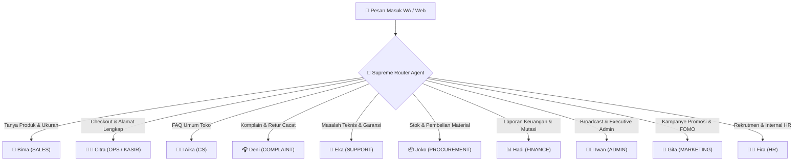

# 🤖 KasKu-AI — Flagship Autonomous Multi-Agent E-Commerce Engine v2.0

> **KasKu-AI** adalah Platform E-Commerce WhatsApp Otonom berbasis Node.js, Baileys WhatsApp API, dan Midtrans Payment Gateway. Sistem ini mengoordinasikan **10 Agen AI Spesialis** yang mengelola seluruh rantai operasional toko e-commerce secara otomatis 24/7.

---

## 🏛️ Arsitektur 10 Agen AI Spesialis (Multi-Agent System)



---

## ✨ Fitur-Fitur Unggulan Proyek

### 1. 📱 Native WhatsApp Interactive Command Menu (`services/menuService.js`)
Pesan masuk seperti `menu`, `!menu`, atau pilihan angka `1` s/d `9` langsung merespon dengan **Kartu Menu Terstruktur Native WhatsApp**:
- **`1`** ➔ 🛍️ Katalog & Brosur Produk (`[KIRIM_BROSUR]`)
- **`2`** ➔ 🛒 Persistent Shopping Cart (`config/carts.json`)
- **`3`** ➔ 💳 Bayar Instan (Midtrans / QRIS / VA Bank)
- **`4`** ➔ 📦 Lacak Status Pesanan Live (`#KASKU-XXXX`)
- **`5`** ➔ 🚚 Cek Tarif Ongkir Ke Kota Anda (`ongkirService.js`)
- **`6`** ➔ 📊 Cek Stok Gudang Real-Time (`stockStore.js`)
- **`7`** ➔ 💬 Konsultasi Sales (Bima)
- **`8`** ➔ 🎧 Layanan Komplain & Retur (Deni)
- **`9`** ➔ ❓ FAQ & Informasi Toko

### 2. 💳 Midtrans Payment Gateway Integration (`services/midtransService.js`)
- Integrasi Snap API (Merchant ID `M086776065`) untuk pembayaran otomatis **QRIS (GoPay/ShopeePay/OVO)** & **Virtual Account Bank (BCA, Mandiri, BRI, BNI)**.
- Webhook notification `/api/midtrans/notification` dengan SHA512 signature check & Live API Fallback status verification.

### 3. 🚚 Engine Kalkulasi Ongkir Real-Time (`services/ongkirService.js`)
- Terinspirasi dari `andhikamaheva/rajaongkir-nodejs`.
- Menghitung tarif pengiriman otomatis dari **Gudang Utama Tasikmalaya** ke seluruh kota di Indonesia untuk kurir **J&T Express, JNE REG, SiCepat BEST, dan POS Indonesia** berdasarkan berat paket (kg).

### 4. 📦 Real-Time Stock Store & Alert Gudang Joko (`services/stockStore.js`)
- Manajemen persediaan stok per SKU di `config/stocks.json`.
- Pemotongan stok otomatis saat pembelian lunas.
- Alert otomatis ke Agen Joko (Procurement) saat stok barang menipis (`stok <= 3`).

### 5. 🛑 Strict SOP Validasi Alamat Lengkap & Invoice Control
- **Tolak Invoice untuk Alamat Asal-Asalan**: Citra (Kasir) menolak menerbitkan invoice jika alamat tidak lengkap (hanya sebut nama kota seperti "Jakarta" / "Tasik alaya"). Citra mewajibkan format standar kurir (Nama Penerima, Jalan/RT RW/No. Rumah, Kecamatan, Kota, No. HP).
- **Konfirmasi Ukuran & Jumlah Dulu**: Bima & Citra menanyakan ukuran (39-44) dan jumlah pesanan dulu sebelum masuk proses invoice.

### 6. 🎨 Flagship Luxury Web Catalog UI (`/katalog`)
- Antarmuka Glassmorphism Dark Mode dengan Google Fonts *Outfit & Plus Jakarta Sans*.
- Floating Navbar dengan Indikator Bot Status Online Live (`🟢 KasKu AI Online 24/7`).
- Pemutar **Video Demo Produk (`.mp4`)**, Search Bar Real-time, Filter Pills Kategori, dan Lightbox Modal Preview.

---

## 🚀 Instalasi & Memulai Proyek

```bash
# 1. Install dependencies
npm install

# 2. Jalankan server lokal KasKu-AI
npm start

# 3. Jalankan Pengujian Monte Carlo 100-Scenario Stress Test
node scratch/run100ScenarioStressEngine.js
```

Akses layanan lokal melalui browser:
- 📊 **Dashboard Control Center:** `http://localhost:3000/dashboard`
- 🛍️ **Katalog Web Modern:** `http://localhost:3000/katalog`
- 🧑‍🔬 **Evaluator QA Dashboard:** `http://localhost:3000/evaluator`
- 🧪 **AI Sandbox Simulation:** `http://localhost:3000/sandbox`

---

## 📄 Lisensi & Hak Cipta
© 2026 KasKu Store. Ditenagai oleh KasKu Multi-Agent Agentic AI Engine v2.0.
